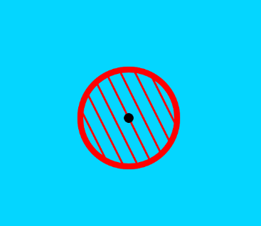
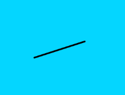
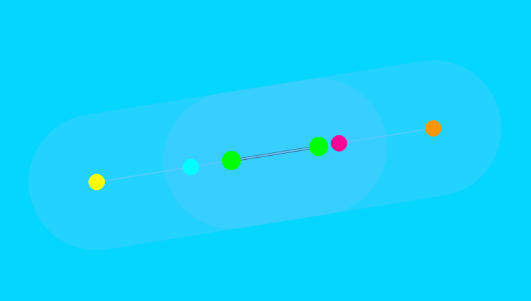
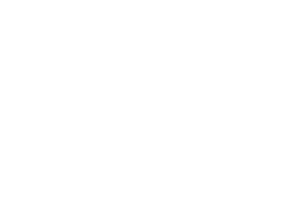

# ATC BUFFA - Air Traffic Control Simulation M2 MIAGE IA2

Simulation de contrôle aérien en 2D basée sur les steering behaviors de Craig Reynolds. Les avions se déplacent d'un point A à un point B en évitant les obstacles et les autres avions à même altitude. Chaque avion dispose d'un carburant limité : lorsqu'il devient insuffisant, l'avion se dirige automatiquement vers l'aéroport le plus proche pour atterrir.

## MON EXPERIENCE

### Inspiration :

J'ai vu un article (de Airbus il me semble) sur un système de pilotage automatique pour avions autonomes : ils suivaient leur plan de vol en temps réel (point à point) et prévoyaient automatiquement un aéroport d'urgence sur leur route en fonction de leur position. L'auteur avait fait un poc en 2D pour simuler ça. Malheureusement je n'ai pas réussi à remettre la main dessus, mais dans mon souvenir il n'y avait qu'un seul avion et ce n'était que du pathfinding — pas de réel comportement de séparation ni d'évitement d'obstacles.

J'ai eu beaucoup de mal à faire la partie où l'avion atterrit dans un aéroport quand il manque de carburant. L'exemple que vous avez fourni dans followPath ne suivait pas parfaitement la ligne.

## Hébergement

Hébergé sur un VPS OVH personnel avec Dockploy pour le déploiement.

Lien : [atc.lavoitureouge.fr](http://atc.lavoitureouge.fr)

Vidéo YouTube : WIP

## Objectifs et contraintes

### Zone d'interdiction de survol

Les avions doivent éviter de survoler ces zones en les contournant.

<p align="center">
  
</p>

### Aéroports (pistes)

Les avions doivent éviter de survoler les aéroports, sauf s'ils y atterrissent. (Change de position à chaque refresh)

| Vue normale | Mode debug |
|:-----------:|:----------:|
|  |  |

> **Mode debug** : la piste est affichée en noir, les premiers points d'approche en orange/jaune selon le sens, et les points d'approche finaux en bleu/rose.

### Nuages

Ils ne servent à rien, ce sont juste des éléments décoratifs qui traversent la scène poussés par le vent.
J'aime bien quand c'est inutile, surtout que j'ai passé un temps fou dessus pour aborder et donner le travail à faire à Claude 🤫.

<p align="center">
  
</p>


## Contrôles
 ### Raccourcis clavier
| Touche | Action |
|---|---|
| `D` | Activer/désactiver le mode debug |
| `F` | Ajouter un obstacle |
| `V` | Ajouter un avion |

### Sliders
| Slider | Min | Max | Défaut | Pas | Description |
|---|---|---|---|---|---|
| **Nombre avions** | 0 | 20 | 1 | 1 | Nombre d'avions simultanés dans la simulation (⚠️ : performance - héberger sur le VPS le moins cher de OVH) |
| **Altitude max** | 0 | 100 | 50 | 1 | Altitude maximale attribuée aux avions à leur création |
| **Carburant max** | 10 | 100 | 100 | 10 | Carburant maximum des avions au départ (déclenche l'atterrissage sous 30%) |
| **Nombre nuages** | 0 | 30 | 5 | 1 | Nombre de nuages décoratifs qui traversent la scène poussés par le vent |


## Comportement

### En vol normal
| Comportement | Méthode | Poids | Description |
|---|---|---|---|
| **Arrive** (vers cible) | `arrive(target)` | ×0.2 | Se dirige vers sa cible en ralentissant à l'approche |
| **Évitement d'obstacles** | `avoid(obstacles)` | ×3 | Esquive les obstacles (montagnes, etc.) |
| **Séparation même altitude** | `separateSameAltitude(vehicules)` | ×1.5 | S'écarte des avions à altitude similaire (±15 unités) |
| **Vitesse adaptée** | `map(alt, 0, 100, 1, 4)` | — | Vitesse proportionnelle à l'altitude |

### Atterrissage (carburant < 30%)

Déclenchement : cherche l'aéroport le plus proche non bloqué par un obstacle, choisit la direction de piste demandant le moins de rotation.

| Phase | Comportement | Poids | Description |
|---|---|---|---|
| **Toutes phases** | `separateSameAltitude()` | ×1.5 | Séparation entre avions à même altitude |
| **Approach 1** | `arrive(wp1)` | ×0.4 | Rejoint le 1er waypoint d'approche |
| **Approach 2** | `seek(wp2)` + alignement wp1→wp2 | ×0.3 / ×0.4 | Rejoint le 2e waypoint en s'alignant sur la piste |
| **Landing** | `pathFollow` + `alignWithPath` + `seekEnd` | ×0.3 / ×0.4 / ×0.2 | Suit le couloir d'atterrissage, s'aligne, se dirige vers la fin de piste |
| **Descente** | réduction `alt -= 3` | — | L'altitude descend à 0 progressivement (< 100px de l'aéroport) |


## IA et IDE
Utilisation de Visual Studio Code et de GitHub Copilot pour le développement

Les modèles utilisés sont : Claude Haiku 4.5 et Opus 4.6
Passage de Claude Haiku 4.5 à Opus 4.6 pour plus de tokens.

 Le fichier d'instructions utilisé pour Copilot est [.github/copilot-instructions.md](.github/copilot-instructions.md).

 ## Déploiement

### Architecture

Le projet est servi via **Nginx Alpine** dans un conteneur Docker, déployé automatiquement sur un VPS OVH via **Dokploy**.

### Workflow CI/CD

Le fichier [`.github/workflows/docker.yml`](.github/workflows/docker.yml) déclenche automatiquement le déploiement à chaque push sur `main` :

```
Push sur main → GitHub Actions → Build image Docker → Push sur Docker Hub → Webhook Dokploy → Déploiement auto
```

**Étapes du workflow :**

1. **Checkout** du code
2. **Build** de l'image Docker (Nginx Alpine + fichiers statiques)
3. **Push** sur Docker Hub (`thiboood/atc-buffa:latest` + tag SHA du commit)
4. **Appel webhook** Dokploy pour déclencher le redéploiement automatique

### Dockerfile

```dockerfile
FROM nginx:alpine
COPY . /usr/share/nginx/html/
EXPOSE 80
CMD ["nginx", "-g", "daemon off;"]
```

### Hébergement

- **VPS** : OVH personnel
- **Orchestration** : Dokploy
- **Registry** : Docker Hub (`thiboood/atc-buffa`)
- **Lien** : [atc.lavoitureouge.fr](http://atc.lavoitureouge.fr)


## link :
https://docs.google.com/presentation/d/1KACjUkg9xarx656LXUrwJLLHulNr8NWvjlmMHctGVtQ/edit?slide=id.g3a2f9fd46d8_0_0#slide=id.g3a2f9fd46d8_0_0

